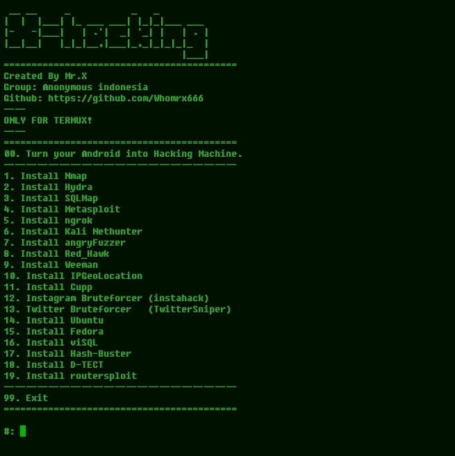

# X-hacking


## introduction
Turn your android into a dangerous hacking machine

## Instalations
```
$ pkg update -y && pkg upgrade -y
$ apt update -y && apt upgrade -y
$ pkg install git
$ git clone https://github.com/Whomrx666/X-hacking
$ cd X-hacking
$ chmod +x X-hacking.py
$ python X-hacking.py
```
## Note
[ONLY FOR TERMUX]

## Instructions
- **First**: Install tools according to the instructions above
- **second**: Select one of the tools in the list
- **Third**: If you want to install all the tools, just type 00
- **Fourth**: Run the tools that you have installed
- **Last**: Congratulations, your Android has become a hacking machine

## Observation
This is a tool for education only, I am not responsible for any misuse
### Original Author
<a href="https://github.com/Whomrx666"></a>

### <<< If you copy , Then Give me The Credits >>>

## CONNECT WITH ME :

[](https://whomrxhackers.blogspot.com/)
[](https://twitter.com/whomrx666)
[](https://wa.me/6285926601133?text=Halo%2C%20Mr.X)
[](https://www.facebook.com/whomrx.666)
[](https://t.me/Whomr_X)
[](mailto:whomrx666@gmail.com)
[](https://www.tiktok.com/@whomr.x)

**If you want to donate, click on the button**
<a href="https://saweria.co/whomrx"></a>

---

<p align="left">
  
</p>

---